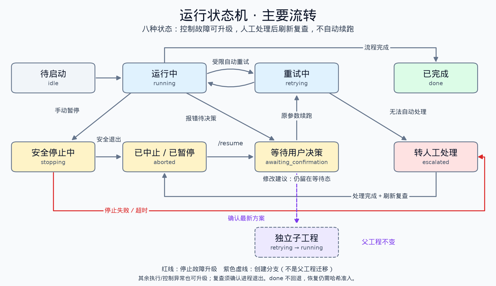

# 运行助理

## 目标与边界

运行助理面向当前选中的 `run_id` 提供状态、阶段、ETA、公开错误、受限运行事实和项目说明。它是只读对话入口，不拥有 shell、任意文件访问、配置写入或停止权限。

每个 run 的浏览器聊天和展示事件原子保存到 `run_assistant_history.json`。刷新和工程切换只恢复目标 run 的记录；fork 完整复制父 run 的上下文和聊天记录为独立快照，后续写入只作用于子 run；resume 直接沿用原 run，不发生继承。

方案助理使用独立的预启动工作区：无活动流水线时默认绑定最近未正式化的 `temp__` 或 `plan__`；本地任务栏可额外创建任意多个 `temp__`。首次出现待确认方案时，`temp__` 改名为 `plan__` 并将对话与候选持久化到 `proposal.json`。每个正式 `md__` 也保存自己的方案助理会话，完成或中止后仍可读取。已有 `plan__` 的新候选覆写同一计划；已有 `md__` 的新候选会新建并跳转至 `plan__`，原工程保留旧会话，新计划只包含触发新方案的最后一条用户请求及本轮方案回复。只有明确运行请求才允许将 `plan__` 变为正式 `md__` 工程；页面刷新、工程切换或普通问答不能创建运行进程。

运行助理的步骤消息由状态快照驱动：历史状态气泡会被当前状态替换，因此只有当前未完成的工序显示加载圈。新工程注册后、首个状态快照写入前的确定性空档显示“准备中”，而非“未知”；这只是前端展示投影，不改变状态机。完成步骤保留“第 N 步已完成”的完成气泡；流水线结束后当前状态也显示完成而不再转圈。右侧进度按当前将要或正在执行的步骤显示：准备中和第 1 步为 `1/10`，第 10 步执行中为 `10/10`；无活动步骤的等待、停止或升级状态保留实际完成数。完整十步流程进入 `done` 后，状态气泡下方会持久化一个完成交付气泡，显示固定相对目录 `../Willy/md_run/<run_id>` 与 `prod.gro`、`prod.xtc`、`prod.trr`、`prod.edr` 等核心生产文件名；它不扫描或公开完整文件树、绝对路径或原始日志。GROMACS 从“暂未获得 ETA”变为可用 ETA、更新预测或结束阶段时，会更新同一状态气泡；其事件游标绑定脱敏 ETA 摘要，避免只在侧栏刷新后才能看到新预计结束时间。

第 8 步产生的公开待确认调整方案会作为运行助理气泡持久化到该工程的 `run_assistant_history.json`。气泡位于当前工程状态之后，固定展示“问题”“当前步调参重试”“打回前序流程重试”和逐点“证据”，并标明当前路径是否适用、受控重跑起点及已脱敏的调整项。EQ 调参和前序回退均标为高风险，必须人工审核和明确确认；刷新后按 `action_id` 去重并恢复，候选配置、原始日志和未公开字段不得进入气泡。

本地任务栏按 `Previous Process`（`md__`）、`Plan`（`plan__`）和 `Temporary List`（`temp__`）分区，目录只沿 `temp__ -> plan__ -> md__` 升级。运行工程支持显示名重命名；三类目录均可删除。删除 `plan__` 需要两次确认，任何活动流水线存在时删除请求均被拒绝。

## 可见事实

运行助理只能通过只读工具读取：公开状态、阶段许可摘要、固定产物索引、ETA、环境能力摘要、受限盒子参数、错误建议和项目白名单文档。它不得输出命令、绝对路径、原始日志、完整配置、完整 prompt、密钥或内部证据。

ETA 是观测结果，不是完成承诺。没有有效 ETA 时，助理必须说明当前阶段正在执行或暂不可估算，而不能自行推导结束时间。

## 受控命令

| 命令 | 作用 | 服务端约束 |
|---|---|---|
| `/resume` | 原工程原参数续跑 | 校验连续完成前缀、稳定配置、逐步输入哈希与上游许可；不应用待确认调整，不创建分支。 |
| `/fork` | 独立子工程调参续跑 | 复制完整上下文并绑定父工程来源；按修改参数的最早依赖步骤失效后续产物，父工程状态不变。 |
| `/inputs [声明]` | 查询候选输入或接纳明确声明的新输入 | LLM 决定文件与消费步骤范围；服务端校验目录、非空、格式及 SHA-256，只接纳该文件版本。 |
| `/switch <run-id>` | 切换当前展示工程 | 只接受带或不带 `md__` 前缀的合法运行编号；切换只改变展示绑定，并分别记录源与目标事件。 |

停止只由前端中止按钮触发，且必须经过服务端二次确认。聊天中的“暂停”“中止”等文本没有停止权限。

`/resume` 与 `/fork` 的流水线子进程沿用 Web 父进程的 Python，与普通启动和确认重跑共用启动命令构造器。
解释器不取自 PATH 或 `.env` 中的科学工具默认值，也不绑定 Anaconda。Web 启动前须通过 Python 3.10--3.12
及核心依赖检查；该检查不替代运行恢复的阶段许可、checkpoint 和配置契约。

## 原样续跑准入

`/resume` 不继承、不改参、不另建工程：沿用原 run 的稳定配置和已完成前缀，从首个未完成步骤重放。
`aborted`、`awaiting_confirmation` 和 `escalated` 均可申请，不要求先有 LLM 方案；即使存在待确认新方案，`/resume` 也只选原参数，绝不隐式应用该方案。按钮“原参数续跑”及明确的“按原参数续跑”等指令使用同一准入入口，普通询问或否定表达不触发启动。
`escalated` 通过准入后先转 `aborted`，再沿原有 `awaiting_confirmation -> retrying -> running` 路径恢复；准入失败不改变状态。不增加状态或绕过合法迁移表。
活动进程、启动锁/MD 锁被占用、完成前缀不连续或已全部完成时拒绝。故障遗留运行态须先经存活证据调和。

哈希策略为 `verified_or_declared_inputs`。私有 `step_contracts.json` 保存稳定配置签名、输入/产物 SHA-256、
生产步骤、执行编号、准出状态和声明记录。服务端准入、子进程绑定和每个实际步骤启动前均校验，
相同大小但内容变化也拒绝；缺少旧基线不能用“当前文件存在”补造可信来源。配置参数变化只能走 `/fork`。

每步实际消费的文件如下；所有步骤均包含 `config.json`，拓扑引用递归检查且不得越出当前 run。
服务端还保留恢复起点的必要上游许可与后续文件非空预检；文件来源准入不替代原有科学验收。

| 步骤 | 哈希校验输入 |
|---|---|
| 1 结构优化 | 配置中各分子的 `.gjf`（Gaussian）或 `.inp`（ORCA）。 |
| 2 单点与 MOL2 | 各分子的 `.fchk`（Gaussian）或 `.molden`（ORCA）。 |
| 3 RESP | 各分子的 `_opt.fchk`、`.mol2`。 |
| 4 参数化 | 所选后端实际使用的 MOL2，以及 Sobtop 的 CHG；遵循 `molecule_id` 映射。 |
| 5 拓扑组装 | 已验证拓扑组件登记中的 ITP/GRO。 |
| 6 MDP | 稳定配置；三阶段 MDP 均重新生成。 |
| 7 建盒 | 主拓扑、ITP 与递归 include、各组分 PDB 或 GRO。 |
| 8 EM | 拓扑输入、`em.mdp`、`model.pdb`。 |
| 9 EQ | 拓扑输入、`eq.mdp`、`em.gro`；另须 EM 验收许可。 |
| 10 PROD | 拓扑输入、`prod.mdp`、`eq.gro`、`eq.cpt`；另须 EQ 覆盖与数值验收证据。 |

每次重放先将本步骤及其下游待重做产物移动至 `old/<执行编号>/files/`，同时保存配置、状态和契约快照。
归档完成后才开始工作区作业；旧文件不因工具返回成功而获得本轮准出资格，成功必须有本轮非空必需产物。
归档中断可按日志继续；源与归档同时存在等歧义会阻断，不覆盖任一副本。PROD 收尾的中间文件也改为归档，不直接删除。

EM/EQ 从阶段入口重放。PROD 无 checkpoint 时从已验收 EQ 启动；有 `prod.cpt` 时，
仅在原阶段契约匹配、续接文件非空且哈希与中断记录一致（或明确声明该版本）时保留文件并采用 `-cpi -append`。
续接集合包括 CPT/TPR/XTC/EDR/LOG，启用 TRR 时还包括 TRR。不兼容的本阶段旧产物先归档，再重建。
GROMACS 自身的 checkpoint/append 一致性检查仍必须通过。

### 明确声明新输入

先用 `/inputs` 查询工程候选输入的名称、相对路径、SHA-256 和消费步骤，再用例如
`/inputs 我更新了 model.pdb，作为第8步的新坐标输入` 明确声明。LLM 只从服务器提供的目录事实中选择文件与步骤；
服务端拒绝越界路径、不相关步骤、空集合、重复文件、空文件、格式错误或决策后再次变化的文件，不提供全局豁免。
没有可用 LLM 时不自动猜测范围。声明回执和专用审计可以展示所选输入的相对路径与哈希；普通只读问答权限不因此扩大。

豁免只跳过指定消费步骤对旧来源哈希的比较，并立即绑定新 SHA-256；再次修改必须重新声明。
文本输入进行对应格式的基本结构/有限值检查，GROMACS 二进制输入由受限辅助命令检查，仍受 20 秒/最多三次尝试约束。
用户选择新的组分 GRO 时，旧的派生 PDB 先归档，避免建盒仍优先使用旧 PDB。
声明不启动计算，不修改配置参数，不补造拓扑验证、EM/EQ 许可或 G-09 数值证据。

已登记旧工程缺少步骤基线时，可以通过明确声明建立接纳记录；配置必须匹配其登记快照，未声明文件仍无准入资格。
任意外部目录的一键导入不在本接口范围内；文件须先放入受管工程并符合当前配置引用/文件命名。
检查不能阻止用户绕过运行锁直接编辑文件；各步骤会重新核验，但仍应避免计算期间修改活动输入。

## 方案确认与恢复

LLM 对 EQ 等可恢复错误只能提出受限调整方案。方案、替代方案和 fork 都必须绑定当前 run、动作标识和配置指纹；未明确确认时不得修改配置、创建进程或重跑科学阶段。

在 `awaiting_confirmation` 且当前 run 仍持有有效待确认动作时，运行助理显示“确认方案并创建分支”按钮。按钮提交动作标识、状态版本和配置指纹，服务端复核后创建完整上下文子工程；仅子工程进入 `retrying`，父工程配置、状态、方案和证据保持不变。输入框只将精确的“确认”“确认调参”“确认重跑”“确认方案”（及“同意/批准”对应表达）作为同一受控操作；其他状态下这些文本只是普通只读问答，不会被识别为重跑意图。

报错后的恢复与手动暂停共用原参数恢复路径，差别仅在于可额外提供 LLM 调整建议。“修改方案”或明确的方案修改指令只替换待确认建议，不启动计算；方案与状态通过同一个可恢复事务发布，生成新的 `action_id` 并递增 `state_revision`。提交前取得启动互斥锁并复核旧版本，防止与原参数恢复或方案确认并发覆盖。生成失败或提交前版本冲突保留原方案；落盘中断由事务日志恢复一致状态。

修改成功后，历史中的旧方案展示失效，卡片和确认按钮绑定最新动作、状态版本及配置指纹；点击后只用该版本创建分支。修改在途禁止确认，过期请求返回冲突并刷新，不自动重试旧方案。多选建议尚未明确选定时禁止确认，可通过修改方案入口明确希望采用的方案。LLM 不可用仍可原参数恢复，参数、输入哈希和阶段许可检查不放宽。

`ErrorKind=unknown` 时，运行助理不会将猜测包装成待确认参数方案，而是显示联网检索申请/人工审核的升级结论。当前版本没有运行期外网检索通道；未来经批准的检索结论只有能落入“当前步调参”或“打回第 7 步建盒”两条受控路径，并经同一白名单、指纹和人工确认门后，才可用于替换方案。

确认后的分支保留上下文副本与来源证据，但重建运行 ID、PID/锁、停止信号及审批权限；继承的数据不是复用父进程控制权。绝对内部路径和链接重绑定到子工程，外部/悬空链接拒绝。重做范围内的旧准出失效，必要的已归档稳定输入仅按哈希恢复到子工程。父工程不迁移状态，方案与分支的幂等关联保存在工程外的 `.willy/run_controls/`。普通启动、resume 和 fork 共用进程启动门：记账、PID 和回收线程交接完成前，子进程不得开始科学作业；失败先回收，无法确认退出时保留锁。

服务启动时会扫描没有启动锁、GROMACS ETA 心跳或阶段产物新鲜写入证据的 `running`、`retrying`、`stopping` 工程，并以 CAS 将其终结为 `aborted`；该动作在 `events.jsonl` 写入 `run_aborted_after_process_exit`，并在 registry manifest 的有界 `interruption_history` 记录来源和阶段，不会自动重跑。若服务在失联进程的宽限期内先启动，用户显式输入 `/resume` 会对当前工程再次执行同一调和；仍有活进程或新鲜证据时保持拒绝，宽限期后可从原目录和原 `config.json` 的首个未完成安全步骤续跑。

### 人工处理后的自动更新

Willy 页面加载、工程刷新和状态轮询会重新检查 `escalated`，不是直接清掉故障：依赖修复重新查询环境，输入修复重新检查稳定配置及哈希准入，停止/回收故障重新确认进程退出。无法根据这些事实判断的未知或科学故障，在处理后点击“已完成人工处理，复查”。该声明绑定本次故障 ID 和状态版本，不能代替输入声明或科学验收。

复查通过后自动回到 `aborted`，显示“人工处理结果已通过复查”，仍需用户明确选择原参数续跑或创建分支。故障仍未解除、进程/锁仍存活、心跳尚在保守宽限期内或复查读盘失败时，继续保持故障状态并给出原因；不会自动运行、改参或重新发送停止信号。停止超过 120 秒未完成会转入 `escalated` 复查，不把未确认退出的工程标成已中止。

每个故障记录步骤和控制环节（初始化、预检、执行、验收、恢复、启动、停止、回收），停止时发生的新故障与原始计算错误关联。刷新不会删除历史错误证据。进程被强杀、断电或存储不可写时无法保证即时落盘，仍依赖外部监控与后续调和，不能宣称状态机覆盖了不可记录的系统故障。

## 项目说明问答

方案助理可在只读模式回答项目架构问题。该模式只读取 `README.md`、`docs/Willy.md`、`docs/status_api.md`、本文件和 `docs/document_registry.md` 的受限标题片段，不调用运行工具、不修改待确认方案，也不启动计算。

## 状态图

实线表示原工程状态迁移，红线强调停止故障升级，紫色虚线表示新建独立分支而不是父工程跳转。八种状态保持不变，补充控制故障的升级出口；图中省略初始化接管、同态更新和部分异常出口。人工处理后的复查只回到 `aborted`，不会自动进入 `retrying` 或 `running`。
矢量版本为 [`run_state_machine.svg`](images/run_state_machine.svg)；维护时可用 `python3 scripts/render_run_state_machine.py` 重新生成，绘图环境需要 Matplotlib 和中文字体，不属于运行时依赖。

## 验收

浏览器验收必须覆盖：状态查询、待确认方案、确认重跑、停止、`/resume`、早于停止点的有效调参 `/fork`、无效参数拒绝与 `/inputs` 声明、刷新恢复和双向 `/switch`。通过标准是工程间历史不串、控制动作有事件审计、公开内容不泄露私有运行信息。
